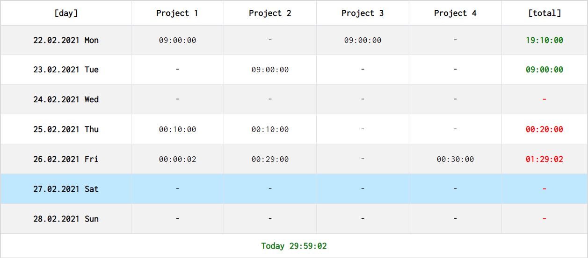
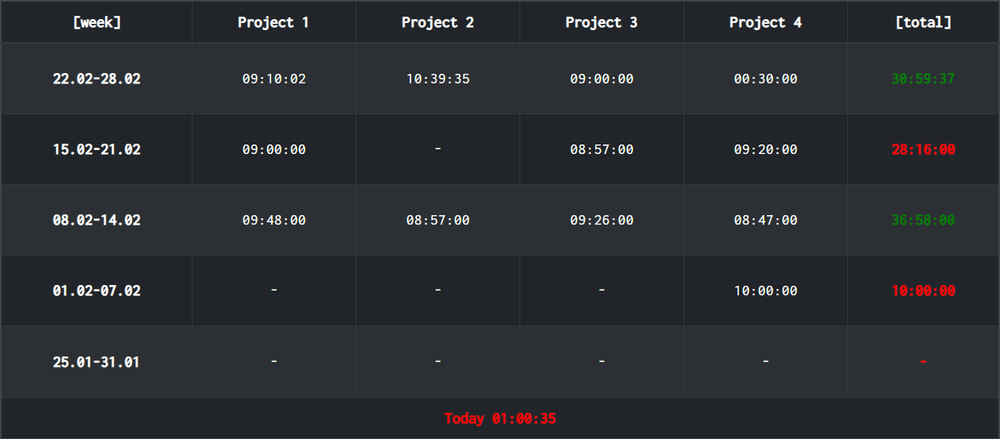

<h1 align="center">
  CLOCKIFY WIDGETS <i>for</i> NOTION
</h1>

<h3 align="center">
  Screenshoots
</h3>

<table>
<tr>
  <td>
    <p align="center">
      
      Daily Light
    </p>
  </td>
  <td>
    <p align="center">
      
      Daily Dark
    </p>
  </td>
</tr>
<tr>
  <td>
    <p align="center">
      
      Weekly Light
    </p>
  </td>
  <td>
    <p align="center">
      
      Weekly Dark
    </p>
  </td>
</tr>
</table>

> :warning: **SECURITY NOTE!**   
> Use that widget in ***only your personal pages***. If the page will be published, you Clockify API key will be shown to the other people. If you publish your page by mistake, go Clockify account and regenerate new API key. 

## Usage

Get API key and workspace ID of your clockify account, add them as query parameters to following url and use it as embed link on your nation page!

```
WEEKLY WIDGET : 
https://serhattsnmz.github.io/notion-widgets/clockify-widget/weekly.html?api-key=<api-key-here>&workspace-id=<workspace-id-here>

DAILY WIDGET :
https://serhattsnmz.github.io/notion-widgets/clockify-widget/daily.html?api-key=<api-key-here>&workspace-id=<workspace-id-here>
```

## Query String Parameters:

| Parameter                     | Type      | Required  | Default   | Explanation               | Example                   |
| ---                           | ----      | --------- | --------- | -------------             | -------                   |
| api-key                       | string    | required  |           | Api key of account        | api-key=xxx               |
| workspace-id                  | string    | required  |           | Workspace ID              | workspcace-id=xxx         |
| dark-mode                     | bool      | optional  | false     | Change dark mode          | dark-mode=true            |
| week-work-limit               | string    | optional  |           | Set min week work limit   | work-limit=20:00:00       |
| day-work-limit                | string    | optional  |           | Set min daily work limit  | daily-work-limit=20:00:00 |
| font-size                     | string    | optional  | 16px      | Table font size           | font-size=20px            |
| border                        | bool      | optional  | true      | Change bordered mode      | border=false              |
| auto-update                   | bool      | optional  | true      | Update table periodically | auto-update=false         |
| auto-update-interval          | int(ms)   | optional  | 30000     | Update interval           | auto-update-interval=1000 |
| week-count (weekly only)      | int       | optional  | 5         | How many week to show     | week-count=5              |
| show-today (weekly only)      | bool      | optional  | true      | Show today total work     | show-today=false          |
| show-week-total (daily only)  | bool      | optional  | true      | Show today total work     | show-today=false          |

## Api Key

Clockify API Key can be found on "Profile Settings > API > Api Key" section.

## Workspace ID

To get workspace id, go to `SETTINGS` page of workspace and workspace id will be shown on URL section of your browser. Example :

```
https://clockify.me/workspaces/<workspace-id>/settings#settings
```

## Work Limit and Daily Work Limit:

If you set work limit, color of **week total time** or **daily time** will change;

- Red, if total time is less than limit;
- Green, if total time is greater than limit

Limit formats must be like "HH:mm:ss", for example "20:00:00" is 20hrs.
