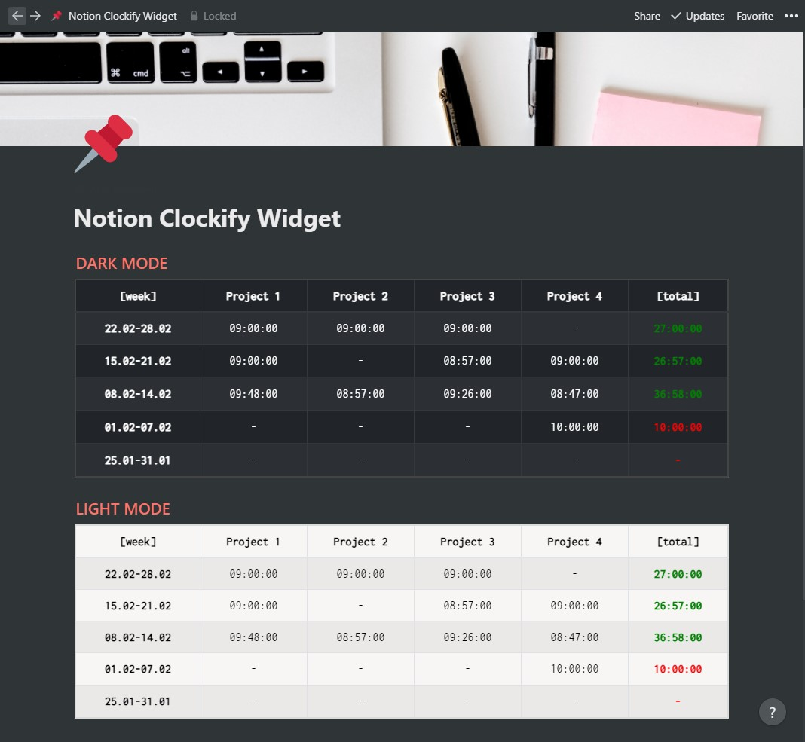

# Clockify Widget

<p align="center">
  
</p>

## Usage

Get API key and workspace ID of your clockify account, add them as query parameters to following url and use it as embed link on your nation page!

```
https://serhattsnmz.github.io/notion-widgets/clockify-widget/?api-key=<api-key-here>&workspace-id=<workspace-id-here>
```

## Query String Parameters:

| Parameter     | Type      | Required  | Default   | Explanation           | Example           |
| ---           | ----      | --------- | --------- | -------------         | -------           |
| api-key       | string    | required  |           | Api key of account    | api-key=xxx       |
| workspace-id  | string    | required  |           | Workspace ID          | workspcace-id=xxx |
| dark-mode     | bool      | optional  | false     | Change dark mode      | dark-mode=true    |
| week-count    | int       | optional  | 5         | How many week to show | week-count=5      |
| show-today    | bool      | optional  | true      | Show today total work | show-today=false  |
| work-limit    | string    | optional  |           | Set min work limit    | work-limit=20:00:00 |
| daily-work-limit | string | optional  |           | Set min daily work limit | daily-work-limit=20:00:00 |
| font-size     | string    | optional  | 16px      | Table font size       | font-size=20px    |
| border        | bool      | optional  | true      | Change bordered mode  | border=false      |
| auto-update   | bool      | optional  | true      | Update table periodically | auto-update=false |
| auot-update-interval | int(milisecond) | optional | 5000 | Update interval | auto-update-interval=1000 |

## Api Key

Clockify API Key can be found on "Profile Settings > API > Api Key" section.

## Workspace ID

To get workspace id, go to `SETTINGS` page of workspace and workspace id will be shown on URL section of your browser. Example :

```
https://clockify.me/workspaces/<workspace-id>/settings#settings
```

## Work Limit and Daily Work Limit:

If you work limit, color of week total time or daily time will change;

- Red, if total time is less than limit;
- Green, if total time is greater than limit

Limit formats must be like "HH:mm:ss", for example "20:00:00" is 20hrs.